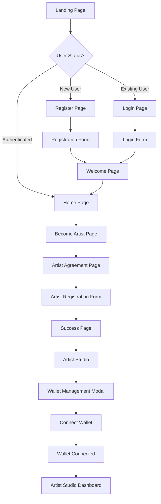
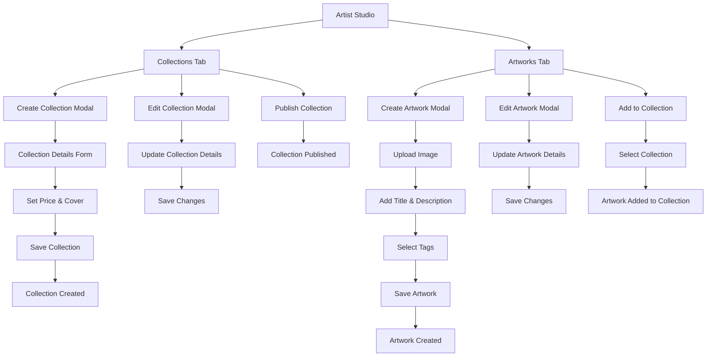
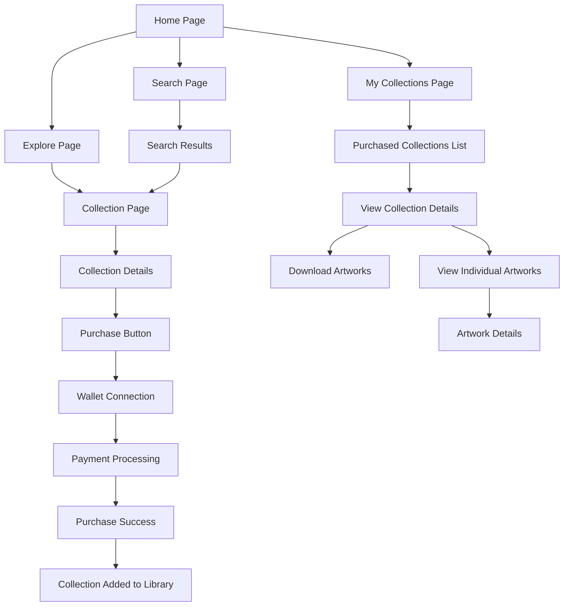

# OnlyArts User Flow Diagram

## Overview
OnlyArts is a Web3-native platform for digital artists to mint, manage, and monetize their work using blockchain technology. This document outlines three key user flows.

## 1. User Register as Artist & Connect Wallet

## 2. Artist Create & Manage Collection and Upload Artwork

## 3. User Buy Collection and View Purchased Collections

